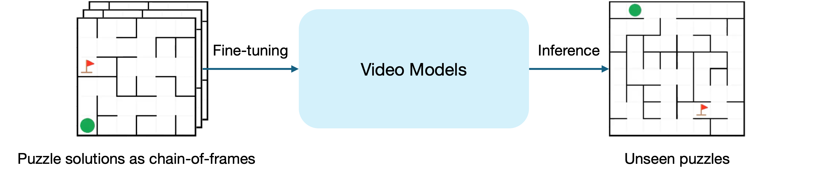

<p align="center"></p>
<h1 align="center"> MiniVeo3-Reasoner: Thinking with Videos from Open-Source Priors </h1>

<p align="center">
  <a href="https://github.com/thuml/MiniVeo3-Reasoner"></a>
  <a href="https://huggingface.co/thuml/MiniVeo3-Reasoner-Maze-5B"></a>
</p>

## 🎯 Overview

Advanced video models have recently demonstrated remarkable [zero-shot capabilities of visual reasoning](https://video-zero-shot.github.io/), solving tasks like maze, symmetry, and analogy completion through a **chain-of-frames (CoF)** reasoning process.

This project shows that such CoF capability can be **acquired by fine-tuning open-source video models** like [Wan2.2](https://github.com/Wan-Video/Wan2.2).

In the maze domain, the fine-tuned models—dubbed **MiniVeo3-Reasoner**—exhibit **surprisingly strong visual reasoning performance**, achieving **near-perfect accuracy** on in-distribution tests and **robust out-of-distribution generalization**.

Under controlled comparisons, MiniVeo3-Reasoner **significantly outperforms baseline approaches** that reason in other modalities such as text or images.



## 🔥 News

- 🚩 **2025.10**: We are thrilled to release MiniVeo3-Reasoner, with mazes as a testbed for visual reasoning!

## 🤗 Models

| Models                    | Download Links                                                           | Description                                                                                                                                                                             |
| ------------------------- | ------------------------------------------------------------------------ | --------------------------------------------------------------------------------------------------------------------------------------------------------------------------------------- |
| MiniVeo3-Reasoner-Maze-5B | 🤗 [HuggingFace](https://huggingface.co/thuml/MiniVeo3-Reasoner-Maze-5B) | Fine-tuned for [Maze](https://github.com/understanding-search/maze-dataset) tasks (3x3 to 6x6 sizes) from the base model [Wan2.2-TI2V-5B](https://huggingface.co/Wan-AI/Wan2.2-TI2V-5B) |

## ✨ Examples

<table style="width: 100%; text-align: center; margin-top: 20px;">
    <tr>
        <td> <b>Problem Setup</b></td>
        <td colspan=2> <b>Examples</b></td>
    </tr>
    <tr>
        <td>Maze 3x3</td>
      <td >
          <video src="https://github.com/user-attachments/assets/2621f354-b180-4d9a-b508-bbb39a9eda74" width="100%" controls autoplay loop></video>
      </td>
        <td>
          <video src="https://github.com/user-attachments/assets/c7984e4b-24dd-4f84-9132-22d2c60f38f9" width="100%" controls autoplay loop></video>
      </td>
  </tr>
   <tr>
        <td>Maze 4x4</td>
      <td >
          <video src="https://github.com/user-attachments/assets/eb07653b-223d-47ac-aa6a-3d8eef371c46" width="100%" controls autoplay loop></video>
      </td>
        <td>
          <video src="https://github.com/user-attachments/assets/b759a98f-50ea-425a-9aea-221585a5b96b" width="100%" controls autoplay loop></video>
      </td>
  </tr>
     <tr>
        <td>Maze 5x5</td>
      <td >
          <video src="https://github.com/user-attachments/assets/9ee1e2f0-11a5-4d94-8c42-b7dd49f245d2" width="100%" controls autoplay loop></video>
      </td>
        <td>
          <video src="https://github.com/user-attachments/assets/fc54cda0-c4ea-4804-a4f5-276a4eba13a2" width="100%" controls autoplay loop></video>
      </td>
  </tr>
    <tr>
        <td>Maze 6x6</td>
      <td >
          <video src="https://github.com/user-attachments/assets/3b1e8a42-bffc-43ef-a600-65e263104408" width="100%" controls autoplay loop></video>
      </td>
        <td>
          <video src="https://github.com/user-attachments/assets/2c69b4d5-3818-4179-8714-7de9d2107122" width="100%" controls autoplay loop></video>
      </td>
  </tr>
</table>

### OOD Generalization

OOD Solution Lengths:

<table style="width: 100%; text-align: center; margin-top: 20px;">
    <tr>
        <td> <b>Problem Setup</b></td>
        <td colspan=2> <b>Examples</b></td>
    </tr>
    <tr>
      <td>Maze 6x6 <br/> (solution len > 12)</td>
      <td >
          <video src="https://github.com/user-attachments/assets/5974d363-a928-404b-8c8a-b51c92778f1b" width="100%" controls autoplay loop></video>
      </td>
        <td>
          <video src="https://github.com/user-attachments/assets/46fda423-80c6-4831-a53a-3c9f817ff594" width="100%" controls autoplay loop></video>
      </td>
  </tr>
</table>

OOD Maze Sizes:

<table style="width: 100%; text-align: center; margin-top: 20px;">
    <tr>
        <td> <b>Problem Setup</b></td>
        <td colspan=2> <b>Examples</b></td>
    </tr>
    <tr>
        <td>Maze 7x7</td>
      <td >
          <video src="https://github.com/user-attachments/assets/d83174ba-7dbf-4397-a33b-de995450dcfa" width="100%" controls autoplay loop></video>
      </td>
        <td>
          <video src="https://github.com/user-attachments/assets/7c24b7ee-65e9-4dfc-8dab-aeca7cd0f631" width="100%" controls autoplay loop></video>
      </td>
  </tr>
   <tr>
        <td>Maze 8x8</td>
      <td >
          <video src="https://github.com/user-attachments/assets/04fdd1aa-cd01-4a87-8a6f-0f398d51cf5b" width="100%" controls autoplay loop></video>
      </td>
        <td>
          <video src="https://github.com/user-attachments/assets/07e63fd8-d224-4c64-b2e6-c483c2069857" width="100%" controls autoplay loop></video>
      </td>
  </tr>
</table>

## 📊 Performance

| Success Rate                   | MiniVeo3-Reasoner-Maze-5B |
| ------------------------------ | ------------------------- |
| Maze 3x3                       | 100                       |
| Maze 4x4                       | 100                       |
| Maze 5x5                       | 100                       |
| Maze 6x6                       | 98.4                      |
| Maze 6x6 (OOD solution length) | 53.6                      |
| Maze 7x7 (OOD size)            | 86.8                      |
| Maze 8x8 (OOD size)            | 59.6                      |

### Comparisons

Under the same amount of training data, we include performance metrics reported in [Visual Planning: Let's Think Only with Images](https://arxiv.org/abs/2505.11409) for reference and comparison.

| Model                            | Thinking Modality | Maze Success Rate |
| -------------------------------- | ----------------- | ----------------- |
| Gemini 2.0 Flash - Direct        | Text              | 8.3               |
| Gemini 2.0 Flash - CoT           | Text              | 6.9               |
| Gemini 2.0 Pro (think)           | Text              | 21.5              |
| Qwen 2.5-VL-Instruct-3B - Direct | Text              | 0.5               |
| Qwen 2.5-VL-Instruct-3B - CoT    | Text              | 0.8               |
| Qwen 2.5-VL-Instruct-3B - SFT    | Text              | 33.3              |
| LVM-3B - VPFT                    | Image             | 59.0              |
| LVM-3B - VPRL                    | Image             | 74.5              |
| MiniVeo3-Reasoner-Maze-5B        | Video             | **99.6**          |

## 🚀 Get Started

### Environment Setup

```bash
conda create -n miniveo3_reasoner python==3.12
conda activate miniveo3_reasoner
pip install -r requirements.txt
```

### Data Preparation

Our data generator produces a series of mazes with configurable size, path length and amount, outputting a `.mp4` video file and a `.png` image (the first frame of the video).

We use a customized version of [maze-dataset](https://github.com/understanding-search/maze-dataset). You can install it as follows:

```bash
pip install -e data/maze/maze-dataset
```

After installation, use the script below to generate mazes with custom configurations:

```bash
python data/maze/maze_generator.py
```

To reproduce the same data distribution used in our experiments, simply run:

```bash
bash scripts/generate_maze_dataset.sh
```

Furthermore, if you want to split the train and test datasets, simply run:

```bash
# make sure you have run scripts/generate_maze_dataset.sh first

bash scripts/split_maze_train_test.sh
```

The result will be in `dataset/train` and `dataset/test` respectively.

### Inference

Our inference is based on [Wan](https://github.com/Wan-Video/Wan2.2) model. See Training Models for further usage.

If you want to try a simple fast inference, download our LoRA weight model on <a href="https://huggingface.co/thuml/MiniVeo3-Reasoner-Maze-5B">huggingface</a> and save it to `./model/`. Then run:

```bash
bash scripts/inference_maze_testset.sh
```

It may take time to download model files of Wan2.2-TI2V-5B the first time you run.

You can also use `inference/maze/inference_maze.py` to perform inference on single file or directory. Run:

```bash
python inference/maze/inference_maze.py [-r] filename/directory
```

### Success Evaluation

We use serveral metrics to evaluate the result.

Our evaluator compares the inference version and the answer version of one single output, then give the max distance of these two trajectories.

The results are divided into several categories based on the distances, and then determine whether it's correct, or it's imperfect.

We provide max-distance and PR (see [Visual Planning](https://github.com/yix8/VisualPlanning)) metrics output. You can add your own metrics at will.

If you follow the same dataset setting as ours, we provide you a shell script to easily evaluate.

```bash
bash scripts/evaluate_maze.sh
```

Make sure your inference results are in `dataset/test` and your result files named properly.

### Training Models

We train [Wan](https://github.com/Wan-Video/Wan2.2) model Wan-AI/Wan2.2-TI2V-5B with LoRA, which is well-instructed. You can easily fine-tune your own models.

For your convenience if you follow ours, you can copy our split train dataset`./dataset/train/.` directly into `DiffSynth-Studio/data/example_video_dataset`.

## 🤝 Contributors

[Jialong Wu](https://manchery.github.io/)\*, [Tianhao Huang](https://github.com/MrH2T)\*, [Changjing He](https://github.com/hcjqwq)\*, [Mingsheng Long](https://ise.thss.tsinghua.edu.cn/~mlong/). (\*: Equal Contribution)

We welcome contributions! Feel free to open [GitHub issues](https://github.com/thuml/MiniVeo3-Reasoner/issues) for bug reports or feature requests.

## 💡 Acknowledgements

- [Veo 3](https://video-zero-shot.github.io/): This project is inspired by the impressive zero-shot performance of Veo 3!
- [Wan](https://github.com/Wan-Video/Wan2.2): Powerful open-source video diffusion models used as base models.
- [DiffSynth-Studio](https://github.com/modelscope/DiffSynth-Studio/tree/main/examples/wanvideo): Video diffusion model training.
- [maze-dataset](https://github.com/understanding-search/maze-dataset): Data generation for maze reasoning tasks.
- [Visual Planning](https://github.com/yix8/VisualPlanning): Baseline benchmark for performance comparison.
- [Nano Banana](https://aistudio.google.com/models/gemini-2-5-flash-image): Help in generating the project logo.

## 📜 Citation

There is currently no technical report available.

If you find MiniVeo3-Reasoner useful, we would appreciate it if you could cite our work:

```
@misc{miniveo3reasoner,
    title = {MiniVeo3-Reasoner: Thinking with Videos from Open-Source Priors},
    author = {Jialong Wu, Tianhao Huang, Changjing He, Mingsheng Long},
    year = {2025},
    publisher = {GitHub},
    journal = {GitHub repository},
    howpublished = {\url{https://github.com/thuml/MiniVeo3-Reasoner}},
}
```
